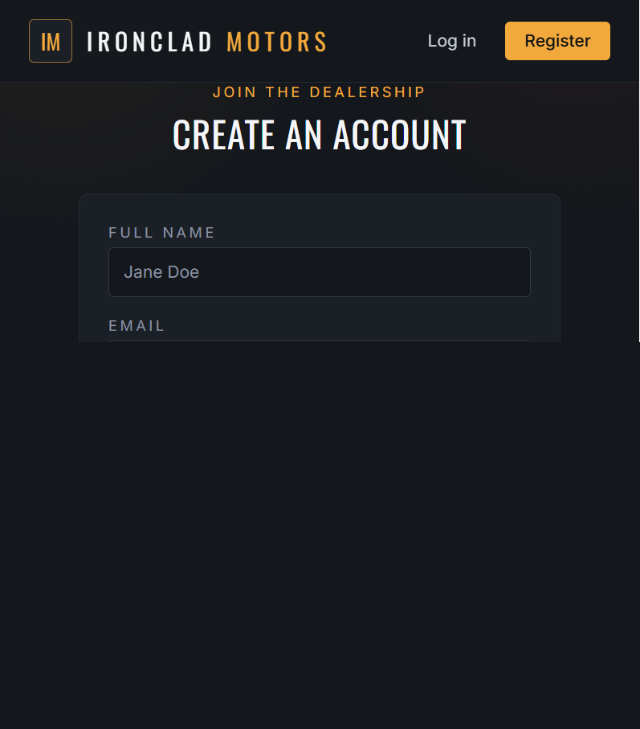
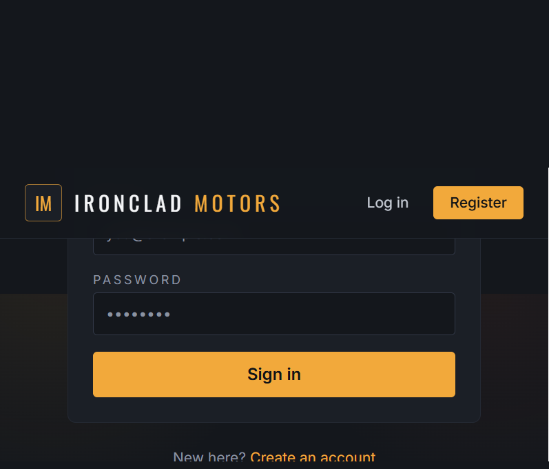
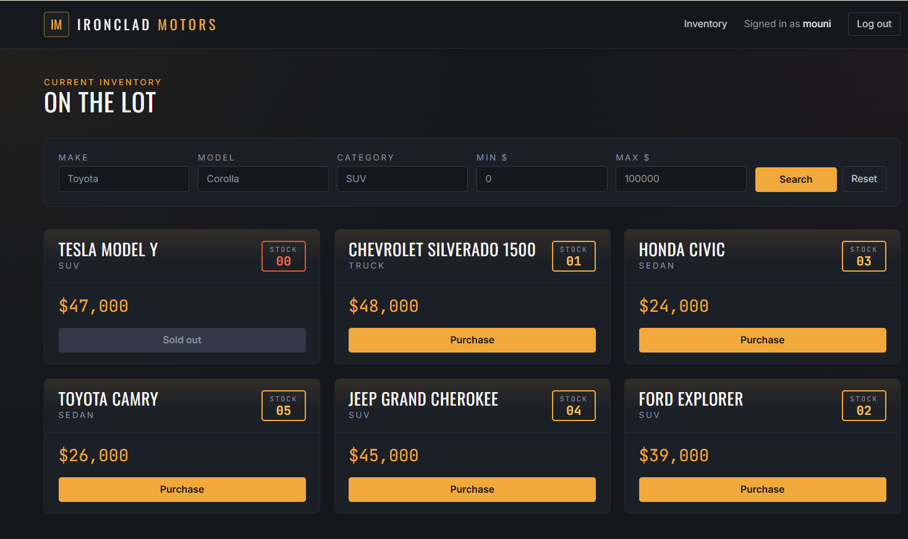
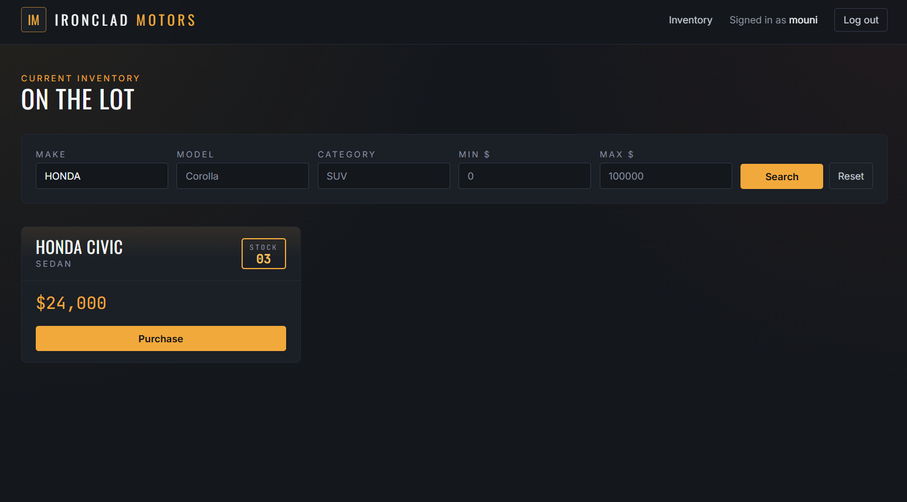
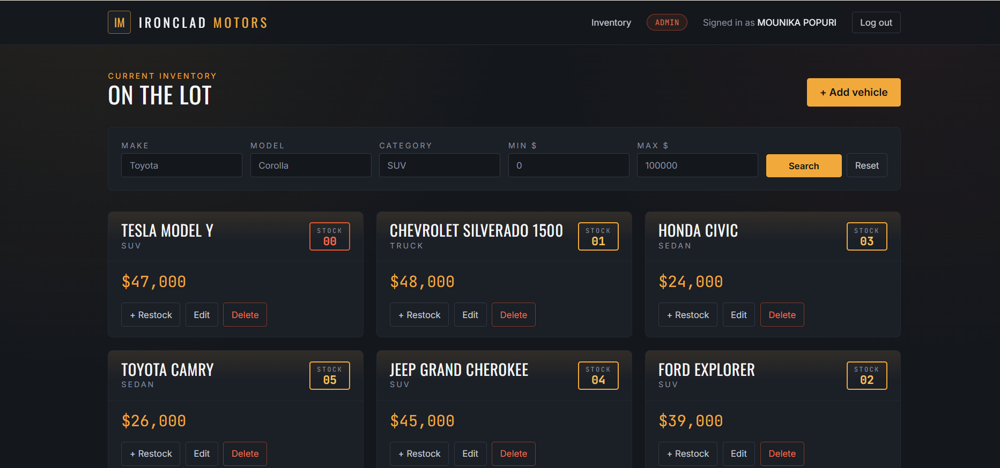
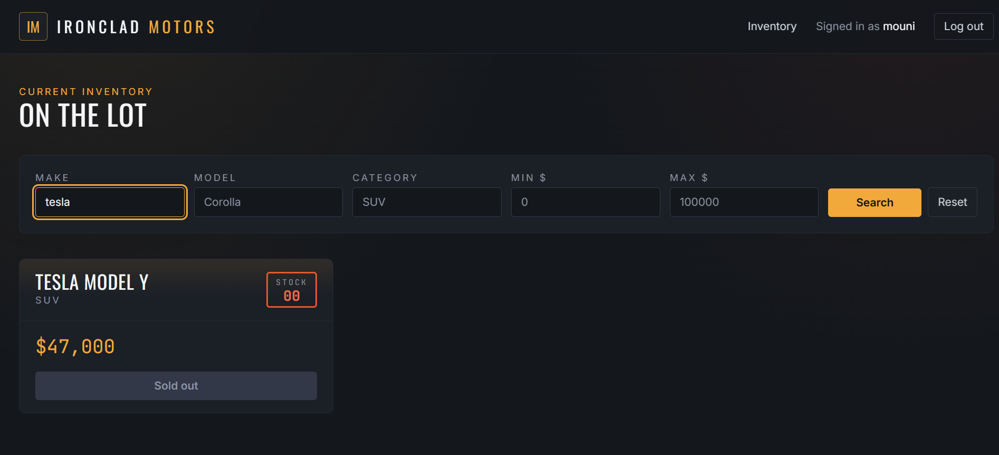

# Ironclad Motors — Car Dealership Inventory System

A full-stack inventory management system for a car dealership: a JWT-secured
REST API (Node.js/Express + SQLite) and a React + Tailwind single-page app
for browsing, searching, purchasing, and (for admins) managing vehicle stock.

Built as a TDD kata — see [`backend/tests`](backend/tests) for the specs
that drove the API, and the git history for the Red → Green → Refactor
pattern behind each feature.

## Table of contents

- [Project overview](#project-overview)
- [Tech stack](#tech-stack)
- [Project structure](#project-structure)
- [Setup and running locally](#setup-and-running-locally)
- [API reference](#api-reference)
- [Testing](#testing)
- [Screenshots](#screenshots)
- [My AI Usage](#my-ai-usage)

## Project overview

Two independent apps, talking over a REST API:

- **`backend/`** — Express API. Handles registration/login (JWT), and
  full vehicle inventory CRUD, search, purchasing, and restocking. Data is
  persisted in a real SQLite file on disk (`backend/data/dealership.sqlite3`),
  not an in-memory store, so it survives a restart.
- **`frontend/`** — React SPA (Vite + Tailwind). Lets customers register,
  log in, browse/search inventory, and purchase vehicles (the Purchase
  button disables itself once stock hits zero). Admin accounts additionally
  get add/edit/delete/restock controls.

## Tech stack

| Layer      | Choice                                                        |
|------------|----------------------------------------------------------------|
| Backend    | Node.js, Express                                               |
| Database   | SQLite via `better-sqlite3` (file-backed, not in-memory)        |
| Auth       | JWT (`jsonwebtoken`) + bcrypt password hashing (`bcryptjs`)     |
| Testing    | Jest + Supertest (backend, TDD)                                 |
| Frontend   | React 19, React Router, Tailwind CSS, Vite                      |

## Project structure

```
car-dealership/
├── backend/
│   ├── src/
│   │   ├── controllers/   # authController, vehicleController
│   │   ├── middleware/    # JWT authenticate + requireAdmin
│   │   ├── models/        # db.js (SQLite), userModel, vehicleModel
│   │   ├── routes/        # authRoutes, vehicleRoutes
│   │   ├── app.js         # Express app (routes, error handling)
│   │   └── server.js      # entrypoint
│   ├── tests/              # Jest + Supertest specs (auth, vehicles)
│   └── data/               # SQLite database files (gitignored)
├── frontend/
│   └── src/
│       ├── api/            # fetch client wrapping the backend API
│       ├── context/        # AuthContext (JWT + user, localStorage-backed)
│       ├── components/     # Navbar, VehicleCard, SearchFilters, etc.
│       └── pages/          # Login, Register, Dashboard
├── TEST_REPORT.txt         # Output of the last `npm test` run (backend)
├── PROMPTS.md               # Raw AI chat log for this project
└── README.md                 # You are here
```

## Setup and running locally

Requires **Node.js 18+**.

### 1. Backend

```bash
cd backend
npm install
cp .env.example .env    # edit JWT_SECRET if you like
npm test                # optional: run the test suite first
npm start                # starts the API on http://localhost:4000
```

The SQLite database file is created automatically at
`backend/data/dealership.sqlite3` on first run — no separate database
server to install or configure.

### 2. Frontend

In a second terminal:

```bash
cd frontend
npm install
cp .env.example .env    # VITE_API_URL defaults to http://localhost:4000/api
npm run dev               # starts the SPA on http://localhost:5173
```

Open `http://localhost:5173`, register an account (choose "Admin" as the
account type to get inventory-management controls), and start adding
vehicles.

### 3. Production build (frontend)

```bash
cd frontend
npm run build     # outputs static files to frontend/dist
npm run preview   # serve the production build locally
```

## API reference

All `/api/vehicles*` routes require `Authorization: Bearer <token>`.
Routes marked **(admin)** additionally require the logged-in user's role
to be `admin`.

| Method | Path                          | Description                              |
|--------|-------------------------------|-------------------------------------------|
| POST   | `/api/auth/register`          | Create an account, returns `{ user, token }` |
| POST   | `/api/auth/login`             | Log in, returns `{ user, token }`         |
| GET    | `/api/vehicles`               | List all vehicles                         |
| GET    | `/api/vehicles/search`        | Filter by `make`, `model`, `category`, `minPrice`, `maxPrice` |
| POST   | `/api/vehicles`               | Create a vehicle                          |
| PUT    | `/api/vehicles/:id`           | Update a vehicle (partial updates allowed)|
| DELETE | `/api/vehicles/:id`           | Delete a vehicle **(admin)**              |
| POST   | `/api/vehicles/:id/purchase`  | Decrease quantity by `{ amount }` (default 1) |
| POST   | `/api/vehicles/:id/restock`   | Increase quantity by `{ amount }` (default 1) **(admin)** |

## Testing

The backend was built test-first. From `backend/`:

```bash
npm test
```

Current results (also saved in [`TEST_REPORT.txt`](TEST_REPORT.txt) at the
repo root):

```
Test Suites: 2 passed, 2 total
Tests:       24 passed, 24 total

File                   | % Stmts | % Branch | % Funcs | % Lines
------------------------|---------|----------|---------|--------
All files               |   89.86 |    83.33 |    86.2 |   93.45
```

## Screenshots

The screenshots below were captured from the running Vite application.

### Register


### Login


### Customer Dashboard


### Search and Filter


### Admin Dashboard


### Sold Out

## My AI Usage

## My AI Usage

### 1. Which AI tools I used

I used **ChatGPT** and **Claude (Anthropic)** as AI-assisted development tools during this project. I used them selectively throughout the development process for technical guidance, troubleshooting, code suggestions, and documentation support.

The project itself was developed and integrated by me based on the requirements provided in the kata.

### 2. How I used them

- **ChatGPT:** I mainly used ChatGPT as a development and troubleshooting assistant. I used it to understand VS Code and npm commands, set up and run the backend and frontend locally, troubleshoot dependency and environment-related issues, and understand error messages encountered during development.

- **Claude (Anthropic):** I used Claude selectively for a few specific coding tasks. I provided the relevant requirements or implementation context and used its suggestions or generated code as a starting point for particular sections. I then reviewed, modified, and integrated the relevant parts into my project.

- I used AI tools to discuss possible approaches when I encountered implementation problems, rather than relying on them to independently design and build the entire application.

- AI assistance was also useful for generating ideas for test cases and checking possible edge cases related to authentication, vehicle inventory, purchasing, and restocking.

- During development, whenever an error occurred, I used AI to help understand the possible cause and possible solutions. I then tested the suggested solutions in my actual development environment and made the required changes based on the results.

- I also used AI assistance while preparing and improving parts of the project documentation, including the README and setup instructions.

- All AI-generated suggestions and code were reviewed before being used. I was responsible for integrating the different components, making implementation decisions, testing the application, and verifying that the final result matched the requirements.

- The raw AI conversations used during development are included in [`PROMPTS.md`](PROMPTS.md), as required by the assignment.

### 3. Reflection on how AI impacted my workflow

AI tools helped improve my development workflow by reducing the time spent searching for commands, debugging common errors, and exploring possible implementation approaches.

One of the main benefits was during the setup and debugging stages. When I encountered npm, Node.js, dependency, or runtime errors, I could describe the problem to an AI assistant and use the explanation to understand what was happening and what I should investigate next. This was particularly helpful when working with the local development environment.

Claude was also useful when I needed assistance with a few specific coding tasks. Instead of using the generated code without review, I treated it as a reference or starting point, checked how it fit into my existing implementation, and modified it where necessary.

Using AI also encouraged me to think more carefully about testing and edge cases. For example, when implementing inventory-related functionality, AI suggestions helped me consider scenarios such as vehicles with zero quantity, purchasing inventory, restocking, authentication, and authorization.

However, I did not treat AI output as automatically correct. I verified suggestions by running the application, executing tests, checking API responses, and observing the actual behavior of the frontend and backend. When a suggested approach did not work in my environment, I investigated the issue and made the necessary changes myself.

Overall, AI helped me **accelerate development, troubleshooting, and learning**, but it did not replace my role as the developer. I remained responsible for understanding the requirements, implementing and integrating the application, making technical and UI decisions, testing the system, debugging issues, and validating the final project before submission.
